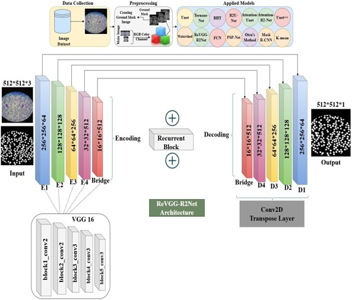

# ReVGG-R2Net: Residual VGG with Recurrent Blocks for Medical Image Segmentation
A robust implementation of ReVGG-R2Net architecture combining VGG16 encoder with Residual Recurrent Convolutional blocks for medical image segmentation.


### Dataset

Due to the large size of the dataset, we have hosted it on Google Drive.  
You can access and download it using the following link:  

👉 [Download Dataset from Google Drive](https://drive.google.com/drive/folders/1CVJXzhVv3MZStsx6y3IjnCPU-EclzjOZ?usp=drive_link)


## Methodology

The overall methodology of our approach is illustrated below:



### Architecture Overview
Encoder: VGG16 with ImageNet pretrained weights (all layers trainable)
Core Innovation: Residual Recurrent Convolutional Blocks (R2 blocks)
Decoder: Transpose convolution with skip connections
Output: Sigmoid activation for binary segmentation

- **Encoder**: VGG16 
- **Core Innovation**: Residual Recurrent Convolutional Blocks (R2 blocks)
- **Decoder**:  Transpose convolution with skip connections
- **Output**: Sigmoid activation for binary segmentation


### Key Features
- **Residual connections with recurrent convolutions**
- **Batch size optimization during training**
- **Comprehensive evaluation metrics (Dice, Jaccard, F1-Score)**
- **Mac MPS GPU support**
- **Robust data preprocessing pipeline**

## Your dataset should have this format:

```bash
dataset/
├── Original
│   ├── image1.jpg
│   ├── image2.png
│   └── ...
└── Mask
    ├── image1.jpg
    ├── image2.png
    └── ...
```


## Installation
```bash
!git clone https://github.com/FahimSultan-cyb/ReVGG-R2Net.git
import os, sys
root_path = os.path.join(os.getcwd(), "ReVGG-R2Net")
os.chdir(root_path)
!pip install -e .
!python setup_colab.py
!python download_pretrained.py

!pip install -r requirements.txt
```


## Training
```bash
from scripts.train import train_model
model, history = train_model("path_of_your dataset")
```


## Inference
```bash
from scripts.evaluate import evaluate_model

results = evaluate_model(
    model_path="pretrained",
    test_data_path="path_of_your dataset"
)
```


## Evaluation
```bash
from scripts.evaluate import evaluate_model
results = evaluate_model(
    model_path="path/to/model.keras",
    test_data_path="path/to/test/data"
)
```

### To run in google coolab (Less memory)
```bash
from scripts.train_colab import train_model_colab
model, history = train_model_colab(data_path="path/to/dataset")

```


